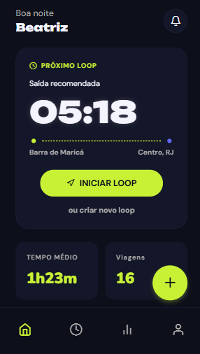
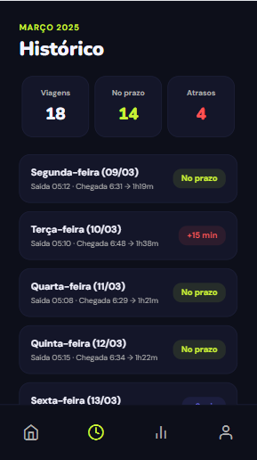
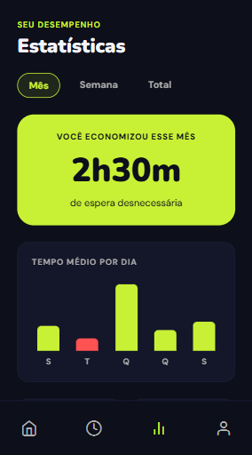
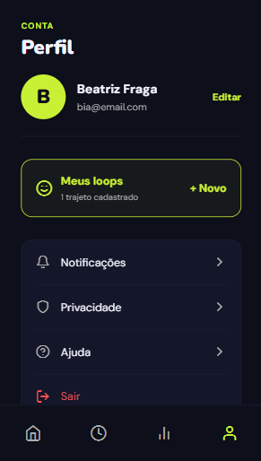
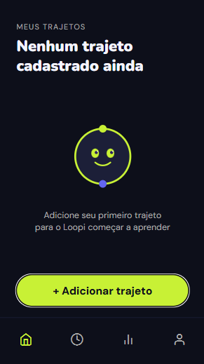
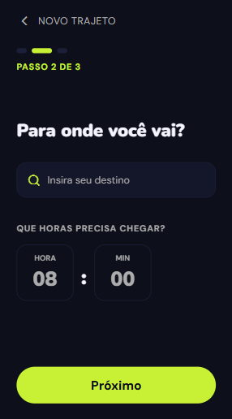

# Loopi App

> App mobile de mobilidade urbana que aprende a rotina do usuário e notifica o horário exato de saída.

Desenvolvido em **React Native** com **Expo**, o Loopi é a interface móvel que se conecta à [loopi-api](https://github.com/biafraga/loopi-api) para entregar uma experiência inteligente de deslocamento urbano.

---

## Sobre o projeto

O Loopi resolve um problema cotidiano: saber exatamente quando sair de casa para chegar no horário. O usuário cadastra seu trajeto diário — origem, destino e horário de chegada — e o app aprende seu padrão de deslocamento para notificá-lo no momento certo de sair.

---

## Telas

<table>
  <tr>
    <td align="center"><b>Home</b></td>
    <td align="center"><b>Histórico</b></td>
    <td align="center"><b>Estatísticas</b></td>
    <td align="center"><b>Perfil</b></td>
  </tr>
  <tr>
    <td></td>
    <td></td>
    <td></td>
    <td></td>
  </tr>
  <tr>
    <td align="center"><b>Login</b></td>
    <td align="center"><b>Cadastro</b></td>
    <td align="center"><b>Bem-vindo</b></td>
    <td align="center"><b>Meus Trajetos</b></td>
  </tr>
  <tr>
    <td></td>
    <td></td>
    <td></td>
    <td></td>
  </tr>
  <tr>
    <td align="center"><b>Origem</b></td>
    <td align="center"><b>Destino</b></td>
    <td align="center"><b>Trajeto Cadastrado</b></td>
    <td></td>
  </tr>
  <tr>
    <td></td>
    <td></td>
    <td></td>
    <td></td>
  </tr>
</table>

---

## Tecnologias

| Camada | Tecnologia |
|---|---|
| Framework | React Native |
| Plataforma | Expo |
| Linguagem | JavaScript |
| Navegação | Expo Router |
| Ícones | Expo Vector Icons |
| Back-end | [loopi-api](https://github.com/biafraga/loopi-api) (Spring Boot) |

---

## Funcionalidades

- [x] Onboarding de boas-vindas
- [x] Cadastro de usuário (fluxo em 2 etapas)
- [x] Login com e-mail e senha
- [x] Recuperação de senha
- [x] Cadastro de trajeto (origem → destino → horário de chegada)
- [x] Integração com sugestões de endereço via Mapbox
- [x] Tela de trajetos cadastrados
- [x] Home com próximo loop e horário de saída recomendado
- [x] Histórico de viagens com métricas de pontualidade
- [x] Estatísticas de desempenho (tempo economizado, tempo médio por dia)
- [x] Perfil do usuário com gerenciamento de loops
- [ ] Notificação de horário de saída (em desenvolvimento)

---

## Como rodar localmente

### Pré-requisitos

- Node.js 18+
- Expo CLI (`npm install -g expo-cli`)
- App **Expo Go** no celular ou emulador configurado
- [loopi-api](https://github.com/biafraga/loopi-api) rodando localmente

### Passos

```bash
# Clone o repositório
git clone https://github.com/biafraga/loopi-app.git
cd loopi-app

# Instale as dependências
npm install

# Inicie o projeto
npx expo start
```

Escaneie o QR code com o Expo Go (Android) ou com a câmera (iOS).

> Certifique-se de que a [loopi-api](https://github.com/biafraga/loopi-api) está rodando na porta `8080` antes de iniciar o app.

---

## Projeto relacionado

O back-end do Loopi é uma API REST desenvolvida em Spring Boot: [loopi-api](https://github.com/biafraga/loopi-api)

---

## Autora

**Beatriz Fraga** — Desenvolvedora Full Stack em formação

[](https://linkedin.com/in/beatrizfraga)
[](https://github.com/biafraga)